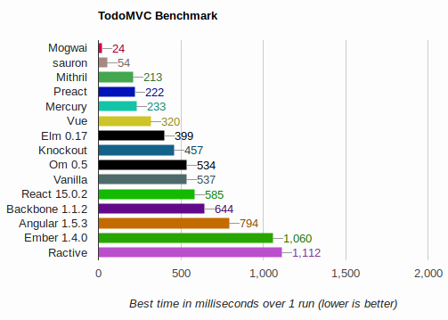

# TodoMVC Performance Benchmark for Mogwai

[mogwai](https://github.com/schell/mogwai) is snappy!



_Results for Firefox 70.0.1 (64-bit)_

[Try running the benchmark in your browser](https://schell.github.io/mogwai/todomvc/perf)

# Setup
```
npm run install
```
# Develop
```
npm run start
```
# TODO
- [ ] Collect client info.
- [ ] Average test.
- [ ] Size comparison.
- [ ] Add more framework.
- [ ] DRY test.
- [ ] Better UI/UX.
