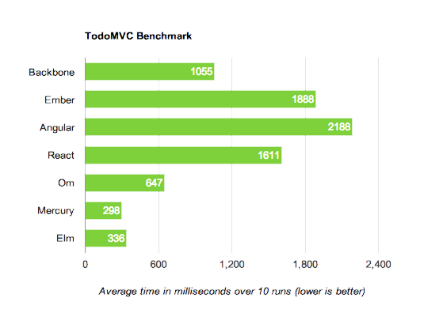

# TodoMVC Performance Comparison

Both Mercury and Elm are based on the [virtual-dom][] project which appears to
be extremely fast.

[virtual-dom]: https://github.com/Matt-Esch/virtual-dom

[**Run it yourself**][runner] to see how it works on your machine or in other
browsers!

Here are some sample results from running this in Chrome 35 with OSX 10.9.4 on
a Macbook Air:

[][runner]

[runner]: http://evancz.github.io/todomvc-perf-comparison/
