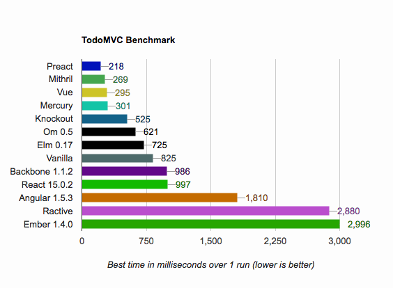

# TodoMVC Performance Benchmark

[](https://rabbots.github.io/todomvc-perf)

# Try
https://rabbots.github.io/todomvc-perf

# Setup
```
npm run install
```
# Develop
```
npm run start
```
# TODO
- [ ] Collect client info.
- [ ] Average test.
- [ ] Size comparison.
- [ ] Add more framework.
- [ ] DRY test.
- [ ] Better UI/UX.
