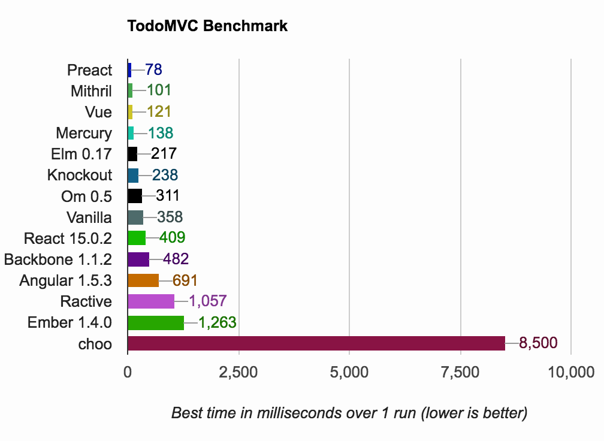

# TodoMVC Performance Benchmark



_(Results for Chrome 51 + OSX 10.10.5 on a Macbook Pro)_

# Try
https://developit.github.io/preact-perf

# Setup
```
npm run install
```
# Develop
```
npm run start
```
# TODO
- [ ] Collect client info.
- [ ] Average test.
- [ ] Size comparison.
- [ ] Add more framework.
- [ ] DRY test.
- [ ] Better UI/UX.
